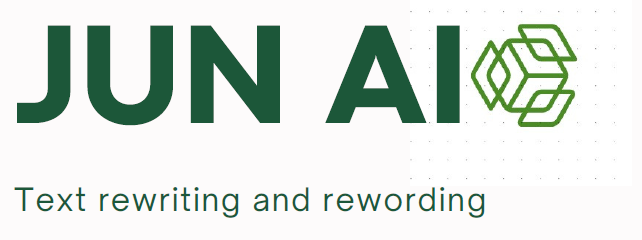

# JUN-AI_Grammatical_Error_Correction_with_T5_Transformer



## ***Overview***
**Jun AI (Grammatical Error Correction)**is a project that can be developed over the long term. The idea is to develop an application for text reformulation, grammar correction and plagiarism detection. Given the time we have, we have only managed to do the grammatical correction aspect. Following the implementation of different models (`RNN`, `LSTM`, `T5 Model`), we obtained better results than with the T5 model based on a transformer (`Happy Transformer`).

***Dataset description***

JFLEG (JHU FLuency-Extended GUG) is an English grammatical error correction (GEC) corpus. It is a gold standard benchmark for developing and evaluating GEC systems with respect to fluency (extent to which a text is native-sounding) as well as grammaticality. For each source document, there are four human-written corrections.

**Languages**
English (native as well as L2 writers)

**Dataset Structure**
Data Instances
Each instance contains a source sentence and four corrections. For example:
```{python}
{
  'sentence': "They are moved by solar energy ."
  'corrections': [
    "They are moving by solar energy .",
    "They are moved by solar energy .",
    "They are moved by solar energy .",
    "They are propelled by solar energy ." 
  ]
}
```

**Data Fields**
*sentence:* original sentence written by an English learner
*corrections:* corrected versions by human annotators. The order of the annotations are consistent (eg first sentence will always be written by annotator "ref0").

**Data Splits**

- This dataset contains **1511** examples in total and comprise a dev and test split.
- There are **754** and **747** source sentences for dev and test, respectively.
- Each sentence has **4** corresponding corrected versions.
